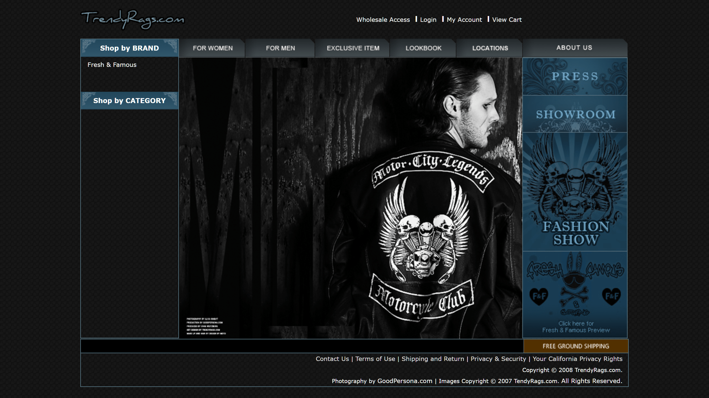

# TrendyRags

이 리포지터리는 https://blog.naver.com/sicho77/114514319 에서 가져온 ASP.NET 2.0 기반의 전자상거래 샘플 애플리케이션입니다. Windows Container로 마이그레이션하기 위한 데모 용도로 코드를 가져왔습니다. 샘플 코드를 기증해주신 BLU (sicho77)님께 감사드립니다.

이 샘플 애플리케이션은 Microsoft Ignite The Tour 2020 Seoul의 `BRK40017 - 기존 IIS/ASP.NET 쇼핑몰 애플리케이션을 KUBERNETES로 옮기기`를 위하여 준비되었습니다.

## 샘플 사용 방법

개별 컨테이너를 실행하기 위하여 `deploy` 디렉터리 아래의 `mssql`, `database`, `web`의 이미지를 빌드하여 `launch.cmd` 스크립트를 실행합니다.

Kubernetes 배포를 위해서는 Azure ACR과 AKS 클러스터를 연결한 후, `kubernetes` 디렉터리 아래의 `kustomization.yaml` 파일의 비밀 번호 설정 부분에 강력한 비밀 번호를 설정하고 `kubectl apply -k .\kubernetes` 명령어를 실행합니다.

최적화된 빌드와 실행을 위해서는 Windows Server 2019 환경에서 컨테이너를 빌드하고 실행하는 것을 권장합니다.
